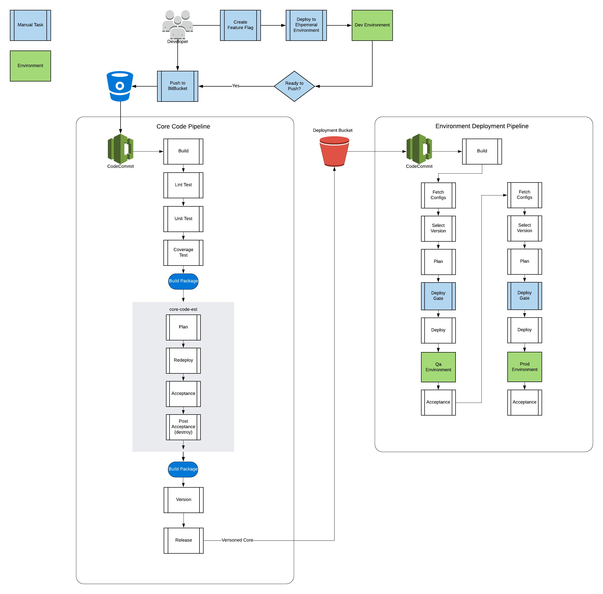

# AWS CICD Pipeline Starter Kit

Bootstrap a Native AWS Codepipeline to your application on AWS. This starter kit uses Terraform to provision two CICD pipelines. The first pipeline is used to run your core code tests, builds, tags, and releases. The second pipeline builds your enviroment based on configurations, and flags with a dependecy to a release version of your code code. 

### Architecture Overview

### Pipeline:
* [Veiw Readme](codepipeline/README.md)

### Code Code Readme
* [Veiw Readme](core-code/README.md)

#### Deploy Code Readme 
* [Veiw Readme](deploy-code/README.md)

