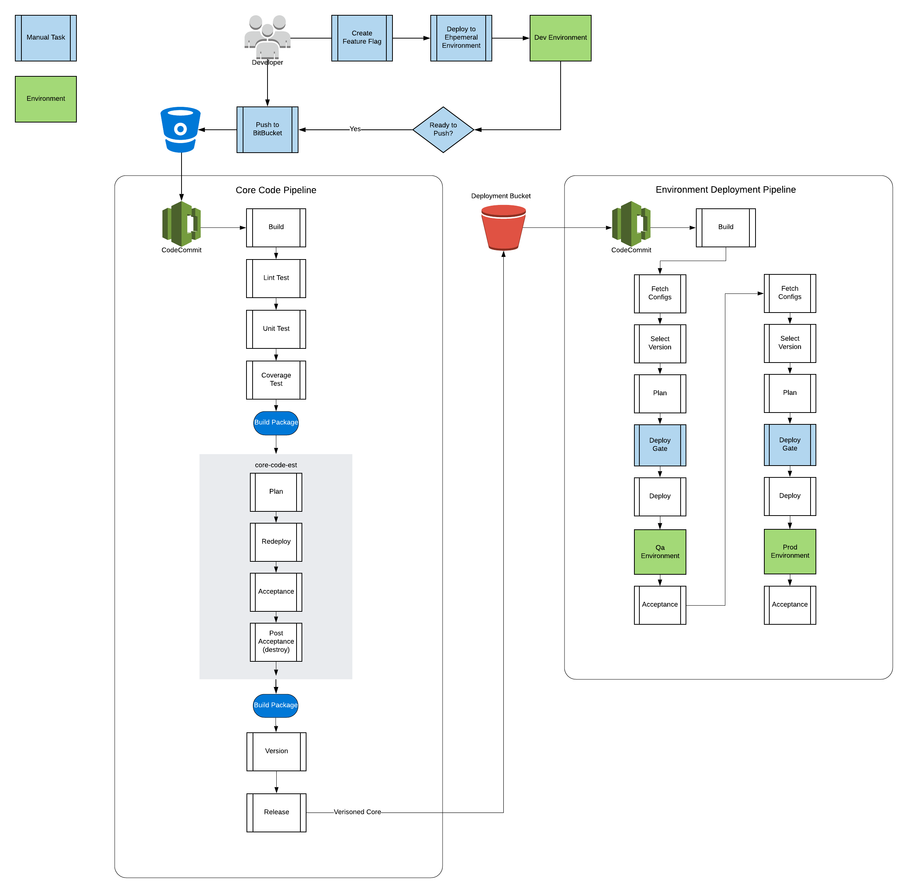

# AWS CICD Starter Kit

Bootstrap a Native AWS Codepipeline to your application on AWS. This starter kit uses Terraform to provision two CICD pipelines. The first pipeline is used to run your core code tests, builds, tags, and releases. The second pipeline builds your enviroment based on configurations, and flags with a dependecy to a relase version of your code code. 

### Architecture Overview


### AWS Services used:
* CodeCommit
* CodeBuild
* Elastic Container Registry (ECR)
* S3
### Other Services
* Bitbucket
* Docker
##### Programming & configuration Languages 
* Shell
* Make
* Terraform
* Jsonnet
* JSON

## Prerequisites
 * AWS Account
 * Terraform
     * Mac OS - $ brew install terraform
     * Windows & Linux - [Installation Instructions](https://learn.hashicorp.com/terraform/getting-started/install.html)
* Docker
     * Mac OS - $ brew cask install docker && docker ps
     * Windows - [Installation Instructions](https://docs.docker.com/docker-for-windows/install/)
     * Linux - [Installation Instructions](https://docs.docker.com/install/)
* tfenv
     * Mac OS - $ brew install tfenv
     * Windows & Linux - [Installation Instructions](https://github.com/tfutils/tfenv)
* go
     * Mac OS - $ brew install go
     * Windows & Linux - [Installation Instructions](https://golang.org/doc/install)
* make
     * Mac OS - $ brew install make (installs as gmake)
     * Windows & Linux - 


## Getting Started

1. Create a s3 bucket for terraform remote backend  .
2. Create a deploy role (App Admin like role this role will be used by our container)
3. Update settings.example.json to match your application info and rename to settings.json
```javascript
{
  "deployRoleARN": "arn:aws:iam::XXXXXXXXXXXX:role/XXXXXXXXXXXX",
  "projectName": "XXX",
  "tfState": {
    "bucket": "XXX-tfstate",
    "region": "us-west-2"
  },
  "region": "us-west-2",
  "s3Suffix": "deployment-info",
  "accountId": "XXXXXXXXXXXX",
  "assumableRoles": [
    "arn:aws:iam::XXXXXXXXXXXX:role/XXXXXXXXXXXX"
  ],
  "applicationCode": "XXXXXXXXXXXX",
  "applicationId": "XXXXXXXXXXXX",
  "docker": {
    "tag": "XXX-build",
    "version": "1.0.13"
  }
}
```
4. Set your enviroment varibles 
```bash
export AWS_PROFILE=  SET TO YOUR AWS ROLE PROVISIONED BY CC HELPER
export IMAGE_NAME= SET SAME AS DOCKER TAG IN settings.json
```
5. Deploy ECR
```bash
make create-ecr
```
6. Deploy Terraform
```bash
make plan
# Verify plan output
make deploy
# How to remove resources
make destroy
```

### Modifying Your Pipeline
The pipeline configuration is an array of codepipeline objects inside of subProjects.json
The schema is defined in subProjects.schema.json
Each pipeline has a title, description, and stages.
* **Title**: defines the Codepipeline name as well as the corresponding codecommit source. 
    * Codepipeline name: The Pipelin name is a concatenation of your Project Name and Title attribute
    * Codecommit Source: The title in which all ASCII letters are lower cased and spaces are replace with dashes
* **Description**: Describes the pipeline
* **Stages** : An Array of Action Objects
* **Action**: An object that defines the tasks in a stage
    * **Type**: Action to be done
        * **build**: The build step in your code, this is where your code complies then runs unit and static tests
        * **action**: where a series of tasks can run.
        * **single-action**: where a one task should happen. ie: tf plan
        * **approval**: a manual gate in your pipeline
        * **post-build**: an action that uses the orginial build output. ie: tf deploy
    * **title**: The title of the action
    * **input**: the input of the action
    * **output**: the output of the action
    * **actions**: Used when the **Type** is action this attribute contains an array of action objects
        * **Type**: same as above
        * **title**: same as above
        * **input**: same as above
        * **output**: same as above
        * **runOrder**: defines the order inwhich the actions should be ran, multiple actions can be set with the same run order value to run in parrallel otherwise actions are ran sequentially.
